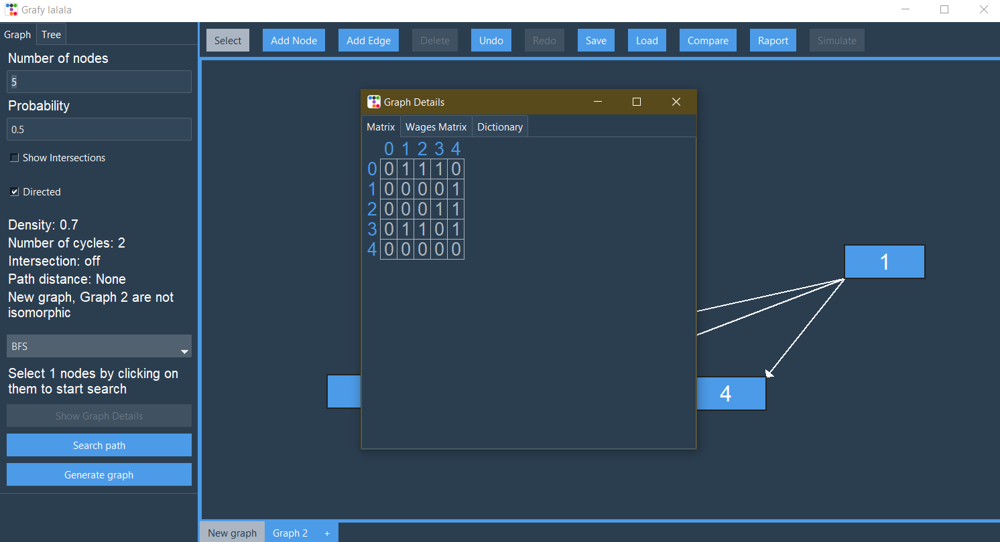

## Overview  
The **Graph Generator & Analysis Tool** is an application for generating and analyzing graphs and trees. It allows users to specify the **number of vertices** and the **probability of edge formation**, generating structured graphs with key insights.  

The application detects **edge intersections** and calculates various graph parameters, including:  
- **Density**  
- **Number of Cycles** 
- **Intersections** 
- **Path Distance**   
- **Graph Isomorphism Check** (when comparing two graphs)  

## Features  
### Graph Generation & Customization  
- Define **vertex count** and **edge probability**  
- **Drag & drop nodes** to adjust layout  
- Interactive **canvas visualization**  

### Graph Algorithms  
- **BFS (Breadth-First Search)**  
- **DFS (Depth-First Search)**  
- **Dijkstra’s Algorithm** (Finds the shortest path between two nodes)  

### Graph Analysis & Visualization  
- Display **adjacency matrix**  
- Show **distance matrix**  
- Simulate **pathfinding algorithms** (BFS, DFS, Dijkstra) step by step  

### Save, Load & Export  
- **Save & load graphs**  
- **Generate reports in PDF format**  

## Screenshots  
  
  
  
  


    

## Installation  
1. Clone the repository:  
   ```bash
   git clone https://github.com/GenWattStudent/Grafy.git
   cd Grafy
   ```

2. Install dependecies
   ```bash
   pip install -r requirements.txt
   ```

## Versions
- Python 3.12.2
- pip 25.0.1